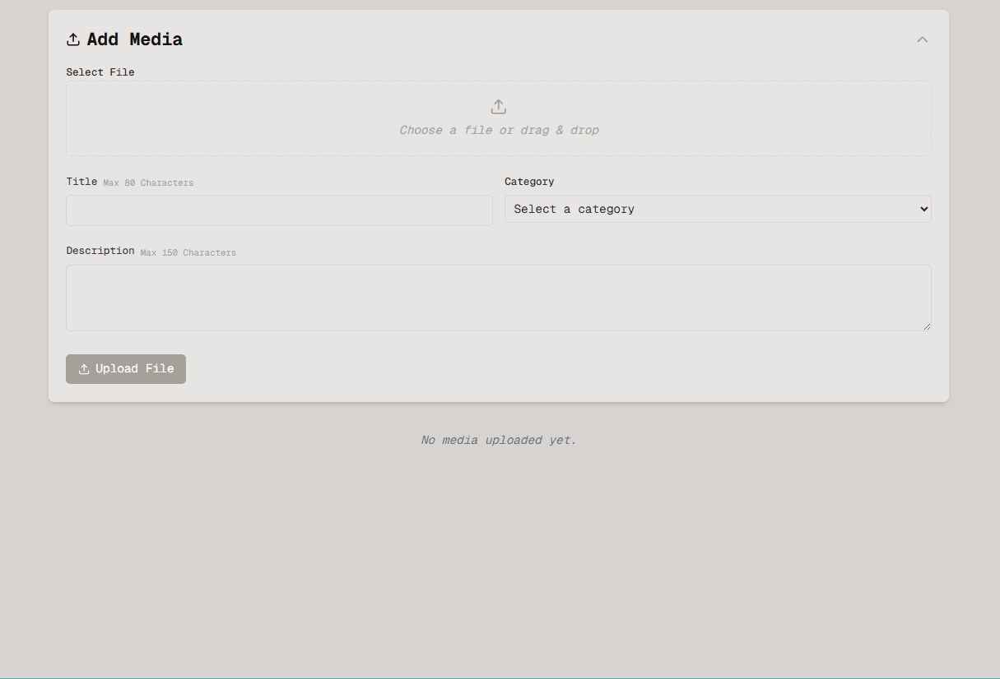
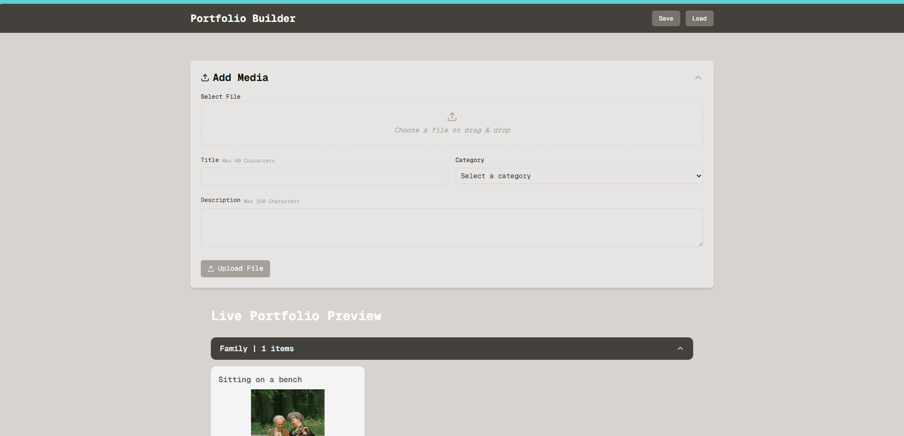
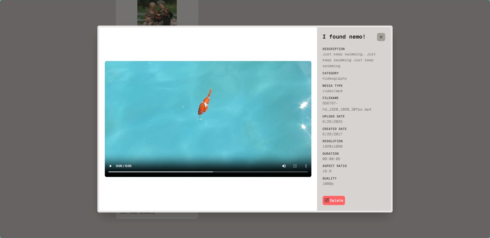
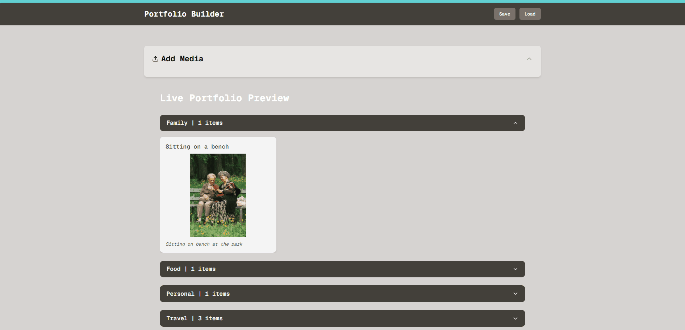
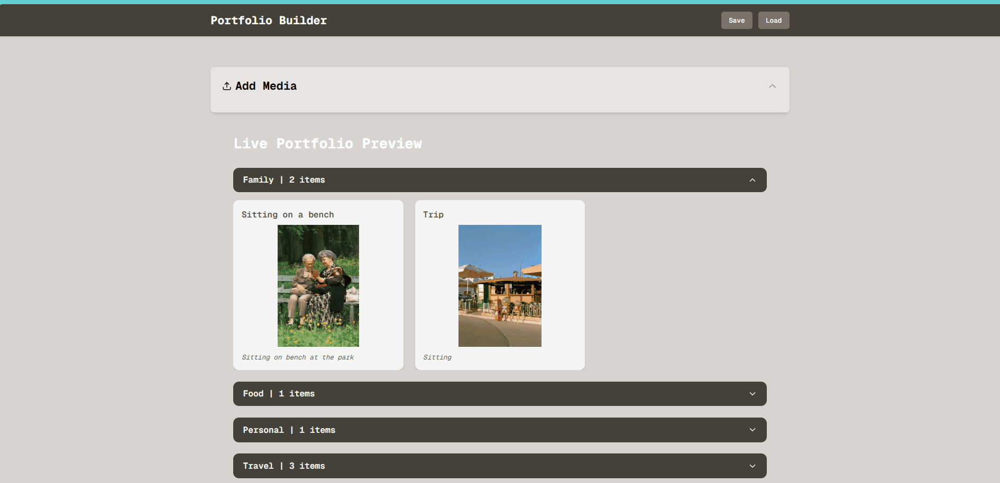
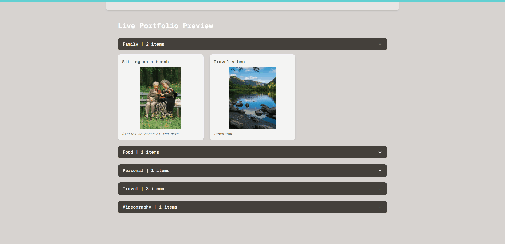

# Cashmere Frontend Take Home

This is my submission for the Cashmere take-home assignment. It includes a full-stack application with frontend and backend components, designed to handle media uploads, delete media files and portfolio preview functionality.

Built with:

- ⚙️ **FastAPI** for backend file processing
- ⚛️ **Next.js + TypeScript** for frontend
- 🎨 **Tailwind CSS** for styling

## 🚀 Setup Instructions

### Start the backend (FastAPI)

```bash
cd backend
pip install fastapi uvicorn pillow pydantic python-multipart ffmpeg-python
uvicorn main:app --reload
```

### Start the frontend (Next.js)

```bash
cd frontend
npm install
npm run dev
```

Then open: [http://localhost:3000](http://localhost:3000)

## 🗂 Project Structure

```
backend/
├── main.py               # FastAPI app

frontend/
├── components/           # Modular UI components
├── context/              # Global state (portfolio, toast)
├── pages/                # Next.js routes
├── styles/               # Global styles
```

## 📡 Backend API Routes

- `POST /upload`: Upload and extract media metadata
- `POST /save-portfolio`: Save user's media portfolio
- `GET /load-portfolio/{user_id}`: Load saved portfolio
- `DELETE /update-portfolio/{user_id}/{item_id}`: Delete a specific media item

## 🖼 Screenshots

### Uploading Media & Preview With Dynamic Field

Upload image or video files via drag-and-drop or file selector.



### Portfolio Preview

Live preview updates as files are added with expandable sections


### Modal Details

Clicking a media item opens a modal with full metadata.  



### Save Portfolio

Saving Portfolio


### Load Portfolio

Loading Portfolio


### Delete Media

Deleting media from local storage and database.  


### Responsive UI

UI adjusts to window size.  


## 📸 Features

- Upload images and videos with dynamic previews
- Extract and display metadata:
  - For **images**: resolution, creation time
  - For **videos**: resolution, duration, aspect ratio, quality, creation time
- View your media with full-screen modals
- Dynamically update preview as you edit
- Delete media (only saved items trigger a backend delete)
- Save only enabled if there are unsaved media items
- Load only when there is media uploaded
- Toast notifications for all major user actions

## 🔮 Future Improvements

- Tests for Frontend and Backend
- User authentication
- Persistent database instead of in-memory storage
- Editable metadata fields
- Drag-and-drop rearranging in preview
- Deploy

Thank you for the opportunity!

## 🙌 Author

Built by Rana Makki, 2025
